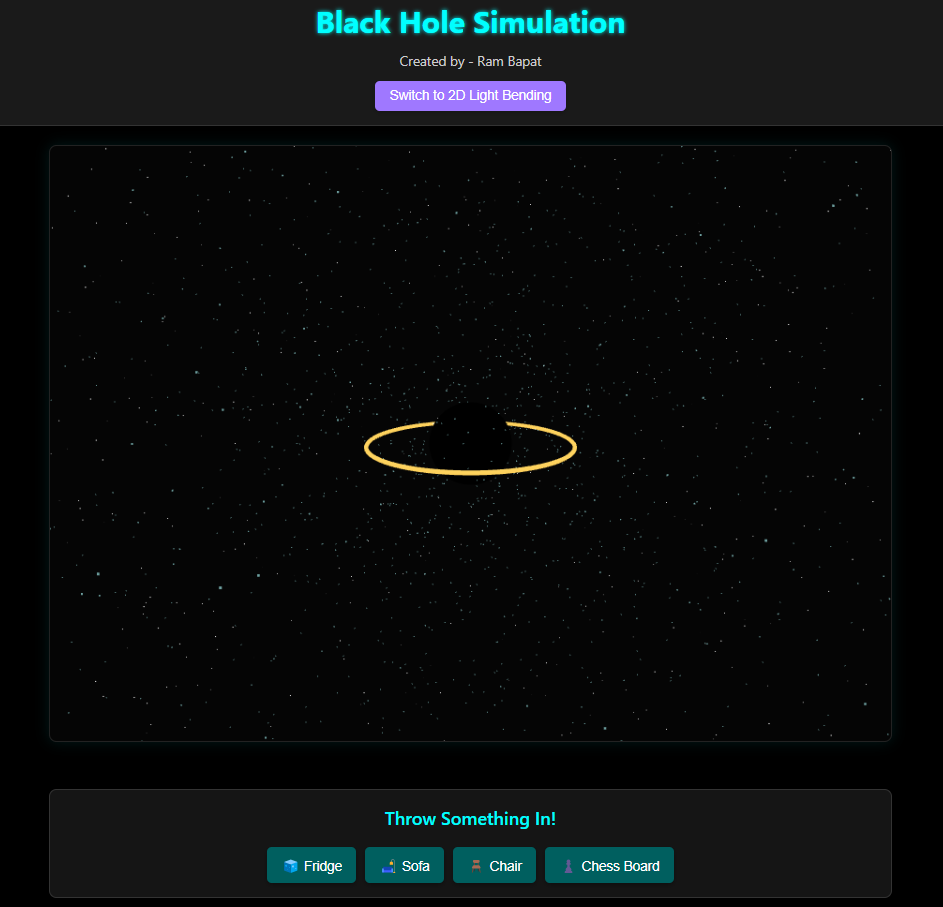
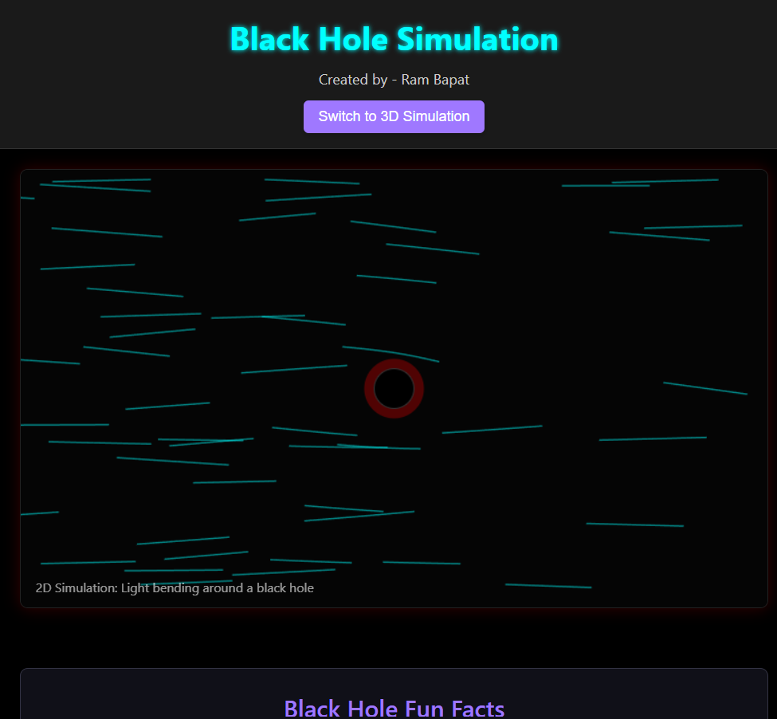
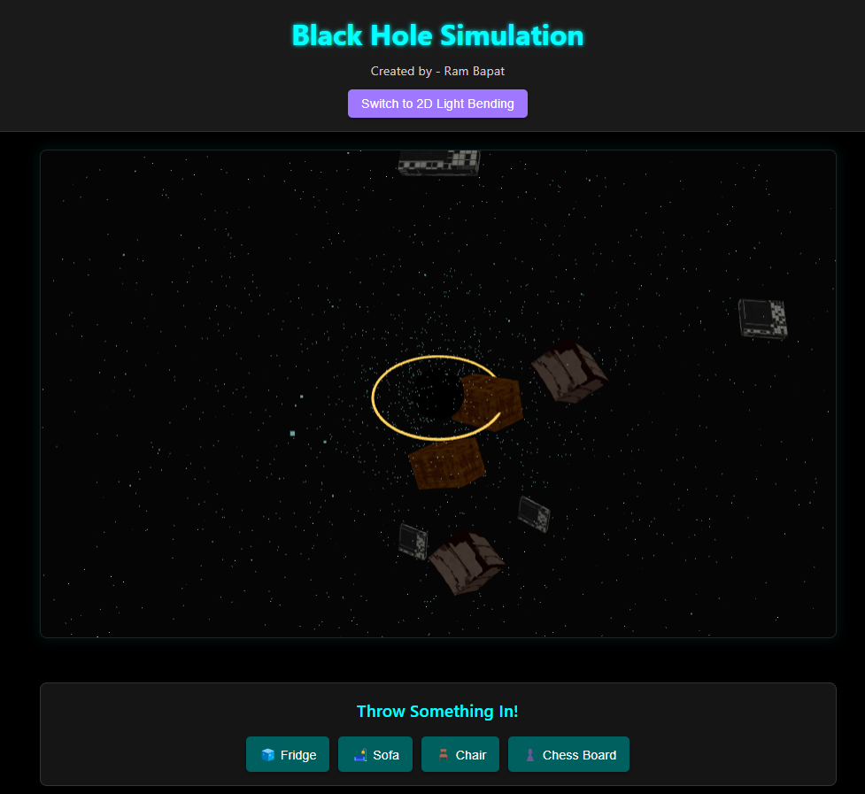

# Black Hole Simulation (React + Three.js) ✨🌌

## Try the live demo - [Demo](https://black-hole-simulation.vercel.app/)

A visually engaging, interactive simulation of a black hole built with React, Vite, and Three.js (`react-three-fiber`). Features include a 3D representation, simulated light rays, comical object throwing, and a toggleable 2D light-bending simulation.

<!-- ================================================== -->

## About This Project: 30 Days of Vibe Coding (Day 9)

This project is part of my **30 Days of Vibe Coding** challenge for April 2025! 🎉

As described in my [LinkedIn announcement post](https://www.linkedin.com/posts/ram-bapat-barrsum-diamos_vibecoding-ai-machinelearning-activity-7312839191153860608-wQ8y?utm_source=share&utm_medium=member_desktop&rcm=ACoAAEokGUcBG1WEFP4A_IMlyO4LNl-eu2MD52w), "Vibe Coding" is the art of using AI models to assist in the coding process—letting the AI generate, test, and suggest ideas, while I refine and explore new possibilities. This project heavily utilized AI for:

*   Initial project setup and structure.
*   Guidance on using `react-three-fiber` and `drei`.
*   Generating boilerplate code for components.
*   Implementing 3D effects (stars, disk rotation, particle movement).
*   Creating the 2D canvas simulation logic.
*   Debugging and refining code snippets.

It's an experiment in creative collaboration between human and machine. 🤖✨

<!-- ================================================== -->






<!-- ================================================== -->

## Overview

This project aims to create a fun, visually stunning, and somewhat educational single-page application simulating concepts related to black holes. It leverages `react-three-fiber` to render a 3D scene featuring:

*   A central black hole representation with a glowing accretion disk.
*   Particles representing light rays being drawn towards the event horizon.
*   A starry background using `drei`.
*   Interactive buttons allowing users to "throw" oversized, textured objects (like a fridge, sofa, chair, or chessboard) into the black hole for a comical effect.
*   A toggleable 2D simulation mode (using HTML5 Canvas) demonstrating the concept of light bending around a massive object.
*   An information section displaying fun facts about black holes.

The primary goal was to explore 3D rendering in React and create an engaging visual experience.

## Features

*   **Interactive 3D Scene:** Rendered using `@react-three/fiber` and `three.js`.
*   **Black Hole Visualization:** Includes a central sphere and a rotating, emissive accretion disk.
*   **Particle Simulation:** Simple simulation of light rays/particles being pulled towards the black hole.
*   **Comical Object Throwing:** Throw oversized, textured 3D objects (Fridge, Sofa, Chair, Chess Board) towards the black hole.
*   **Texture Mapping:** Objects use textures loaded via `@react-three/drei`'s `useTexture`.
*   **Toggleable 2D Simulation:** Switch to a 2D canvas view showing light paths bending around a central mass.
*   **Fun Facts Section:** Displays interesting information about black holes.
*   **Responsive Design:** Adapts to desktop, tablet, and mobile screen sizes.
*   **Modern Tech Stack:** Built with React, Vite, `react-three-fiber`, `drei`, and CSS Modules.
*   **Interactive Controls:** Includes camera controls (`OrbitControls`) in 3D view and buttons for interaction.

## Tech Stack

*   **Frontend:** React 18+
*   **Build Tool:** Vite
*   **3D Rendering:** Three.js
*   **React Renderer for Three.js:** `@react-three/fiber` (R3F)
*   **R3F Helpers:** `@react-three/drei`
*   **2D Rendering:** HTML5 Canvas API
*   **Styling:** CSS3 (CSS Modules, Flexbox)
*   **Language:** JavaScript (ES6+)
*   **Icons:** `react-icons`
*   **Package Manager:** npm

## Getting Started

To get a local copy up and running, follow these simple steps.

### Prerequisites

*   Node.js (v18 or later recommended) installed on your system ([nodejs.org](https://nodejs.org/)). This includes npm.
*   Git (for cloning the repository).

### Installation & Setup

1.  **Clone the repository:**

    ```bash
    git clone https://github.com/Barrsum/Black-Hole-Simulation.git
    ```

2.  **Navigate to the project directory:**
    ```bash
    cd Black-Hole-Simulation
    ```

3.  **Install NPM packages:**
    ```bash
    npm install
    ```

4.  **(Important!) Add Texture Files:**
    *   Ensure you have placed the required texture images inside the `public/textures/` folder. The expected filenames are:
        *   `fridge_albedo.jpg` (for the fridge)
        *   `sofa_albedo.jpg` (for the sofa)
        *   `chair_wood.jpg` (for the chair)
        *   `chessboard.jpg` (for the chessboard)
    *   If you use different filenames, update them in `src/components/SimulationCanvas.jsx`.

### Running the Project

1.  **Start the development server:**
    ```bash
    npm run dev
    ```
    This command will start the Vite development server.

2.  **Open the application:**
    Open your web browser and navigate to the local URL provided by Vite (usually `http://localhost:5173/` or a similar port).

## Contributing

Contributions, issues, and feature requests are welcome as part of the learning process! Feel free to check the [issues page](https://github.com/Barrsum/Black-Hole-Simulation.git/issues).

1.  Fork the Project
2.  Create your Feature Branch (`git checkout -b feature/AmazingFeature`)
3.  Commit your Changes (`git commit -m 'Add some AmazingFeature'`)
4.  Push to the Branch (`git push origin feature/AmazingFeature`)
5.  Open a Pull Request

## License

Distributed under the MIT License. See `LICENSE.md` (you might need to create this file - a standard MIT license text is sufficient) for more information.

## Acknowledgements

*   **AI Assistance:** AI for extensive coding assistance, debugging, and concept generation ("Vibe Coding" partner!).
*   **3D Libraries:**
    *   [Three.js](https://threejs.org/)
    *   [React Three Fiber](https://docs.pmnd.rs/react-three-fiber/)
    *   [Drei](https://github.com/pmndrs/drei)
*   **Core Tools:**
    *   [React](https://react.dev/)
    *   [Vite](https://vitejs.dev/)
*   **Icons:** [React Icons](https://react-icons.github.io/react-icons/)
*   **Texture Images:** [Textures from Poly Haven](https://polyhaven.com/)

---

Built by Ram Bapat - Challenge [\#30DaysOfVibeCoding](https://www.linkedin.com/posts/ram-bapat-barrsum-diamos_vibecoding-ai-machinelearning-activity-7312839191153860608-wQ8y?utm_source=share&utm_medium=member_desktop&rcm=ACoAAEokGUcBG1WEFP4A_IMlyO4LNl-eu2MD52w) - [LinkedIn Profile](https://www.linkedin.com/in/ram-bapat-barrsum-diamos)